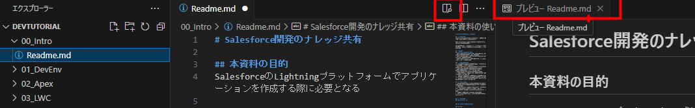
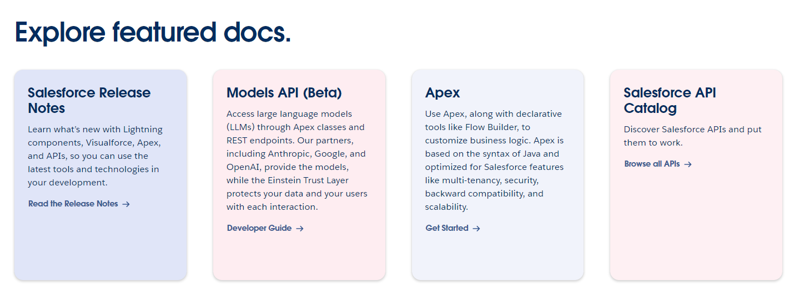
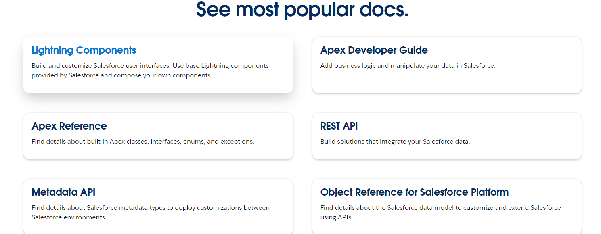
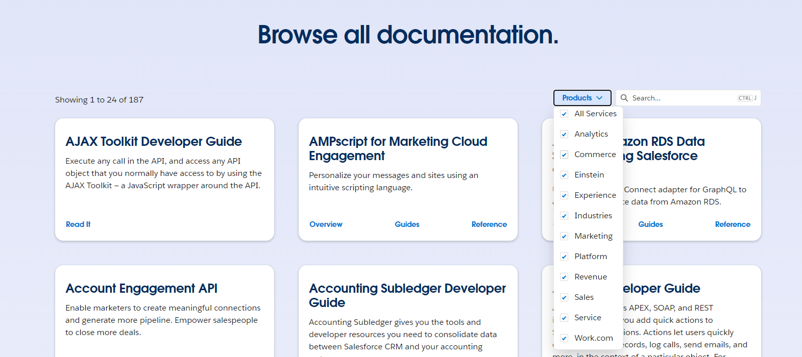
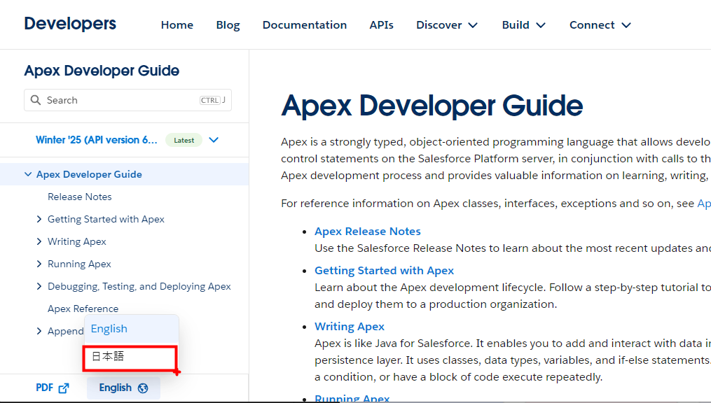

<!-- omit in toc -->
# Salesforce開発のナレッジ共有

- [1. 本資料の目的](#1-本資料の目的)
- [2. ナレッジ共有資料の構成（フォルダ構成）](#2-ナレッジ共有資料の構成フォルダ構成)
  - [2.1. 00\_Intro：導入](#21-00_intro導入)
  - [2.2. 01\_DevEnv：開発環境構築](#22-01_devenv開発環境構築)
  - [2.3. 02\_Apex](#23-02_apex)
  - [2.4. 03\_LWC](#24-03_lwc)
  - [2.5. 04\_VisualForce](#25-04_visualforce)
  - [2.6. 05\_Aura](#26-05_aura)
- [3. 前提知識](#3-前提知識)
  - [3.1. Salesforceに関する知識](#31-salesforceに関する知識)
  - [3.2. 一般的な開発知識](#32-一般的な開発知識)
- [4. 本資料の使い方](#4-本資料の使い方)
- [5. Apex,Visualforce,Lightningコンポーネント(Aura,LWC) の概要](#5-apexvisualforcelightningコンポーネントauralwc-の概要)
  - [5.1. 各種の違い](#51-各種の違い)
  - [5.2. 押さえておきたい特徴](#52-押さえておきたい特徴)
  - [5.3. VisualForce](#53-visualforce)
  - [5.4. AuraとLWCの違い](#54-auraとlwcの違い)
- [6. 公式ガイドの活用方法](#6-公式ガイドの活用方法)
  - [6.1. 特集ページ](#61-特集ページ)
  - [6.2. 最もよく参照されているテーマ](#62-最もよく参照されているテーマ)
  - [6.3. その他テーマ](#63-その他テーマ)
  - [6.4. 各テーマを選択後](#64-各テーマを選択後)

## 1. 本資料の目的
SalesforceのLightningプラットフォームでアプリケーションを作成する際に必要となる
Apex,Visualforce,Lightningコンポーネント(Aura,LWC)などの知識について
各自で学習をスムーズに進められるよう、本資料にて
概要、開発導入、公式サイトの活用方法といったものを解説する

## 2. ナレッジ共有資料の構成（フォルダ構成）
### 2.1. 00_Intro：導入
本パート。Apexとかいろいろな違いをそもそも説明

### 2.2. 01_DevEnv：開発環境構築
VSCodeをインストール⇒Salseforce組織に接続までを説明

### 2.3. 02_Apex
Apexで簡単なデータアクセス等の実装⇒テスト⇒カバレッジ取得

### 2.4. 03_LWC

### 2.5. 04_VisualForce

### 2.6. 05_Aura

## 3. 前提知識
### 3.1. Salesforceに関する知識
- 【必須】Salesforceを利用したことがあり、レコードやオブジェクトといった最低限の知識
- 【必須】様々なデータ種類（テキストや通貨）、簡単なページレイアウトのカスタム
- 【推奨】Salesforce認定アドミニストレータ－の資格、または資格範囲の学習
  
### 3.2. 一般的な開発知識
本資料は新人研修でオブジェクト指向言語（Java）の触りは学習したものと前提とする
- 【必須】Javaの基本的な文法（public/private、クラス・メソッド、分岐/ループ、コンストラクタ/extends/implementsとか）
- 【推奨】SQLに関する知識（SELECT,UPDATE,DELETE,WHEREといった初歩レベルでもOK）
- 【推奨】HTML/CSS/JavaScriptに関する知識
- - HTML：色々なタグでページレイアウトを表現できる…というレベルでもOK
- - CSS：ページ全体のレイアウトが変更できる、特定のタグのみレイアウト変更ができるというレベルでもOK
- - JavaScript：Javaとは違うという認識、型定義できないといった触りレベルでもOK

## 4. 本資料の使い方
1. VSCodeをインストール（01の開発環境構築編にも出てくるけど、適当に最新版をデフォルト設定でインストールしてOK）
2. 「DevTutorial.zip」を任意のフォルダに解凍（フォルダパスに日本語名を含まない場所推奨）
3. VSCodeから解凍した「DevTutorial」のフォルダを開く
4. 各章に配置している「Readme.md」を開く
5. md形式のファイルをプレビュー表示して内容確認しながら進める

## 5. Apex,Visualforce,Lightningコンポーネント(Aura,LWC) の概要
### 5.1. 各種の違い

| 特徴             | Apex                  | Visualforce | Aura              | LWC               |
|------------------|-----------------------|-------------|-------------------|-------------------|
|言語              |Javaベースの**独自言語**|HTML/CSS,Apex|HTML/CSS,JavaScript|HTML/CSS,JavaScript|
|用途              |サーバサイド            |フロントUI    |フロントUI          |フロントUI          | 
|パフォーマンス     |〇                     |△            |△                 |〇                 |
|開発難易度         |中                     |低           |中                  |低                 |
|コンポーネントベース| ×                     |×            |〇                 |〇                  | 
|リリース年         |2007                   | 2007        |2014               | 2019              | 

### 5.2. 押さえておきたい特徴
- Apexはサーバサイド用（ビジネスロジックやデータ編集等）、他はフロントのUI用でそもそもが違う
- 最後のリリース年度に注目
- 2024年時点では、フロントは特別な理由がない限りはLWCで作成することを推奨されている

### 5.3. VisualForce
- VisualForceはClassicでもLightningのどちらでも使用することはできる・・・が
- デザイン面はClassic（旧デザイン）に適している
- 互換性はClassicが完全互換で、Lightningはほぼ互換（一部例外があるらしい）

⇒レガシーシステムで利用されているケースはあるので、保守や再構築時には必要になるかも

### 5.4. AuraとLWCの違い
- Lightningコンポーネントという枠組？の中でAuraとLWCが存在する
- Auraの方が古くて、LWCの方が新しい
- 両方ともHTML/CSS,JavaScriptのフレームワーク（正確には違う）
- AuraはSalesforce独自の言語拡張、独自機能の実装が必要と癖がある
- LWCはモダンなWebの標準技術をベースに作成されているので癖がない（Salesforce以外でも知識が活きる）
- AuraからLWCを呼び出すことは出来る（Auraを捨てず、LWCによってAuraを拡張することも可能）
- LWCが後発組で、まだAuraじゃないと出来ないパターンがたまにある模様

**補足**
JavaScriptも定期的にバージョンアップしており、2015年のES6 or ES2015で仕様の大幅変更が発生（モジュールやクラスといった機能も）
Auraは上記変更を取り込めておらず独自路線、LWCは取り込んで標準に近い方向性

## 6. 公式ガイドの活用方法
[SalesforceのDeveloper用ポータル](https://developer.salesforce.com/docs)

### 6.1. 特集ページ
以下の様に何テーマかが特集されている

### 6.2. 最もよく参照されているテーマ
以下の様にLWCやApexなど、注目されているテーマが取り上げられている

### 6.3. その他テーマ
製品やキーワードで各種テーマが検索可能

### 6.4. 各テーマを選択後
各テーマのページで、左側のメニュー欄の一番下に言語を切り替える場所があるので
英語だとちょっと…という人は日本語に切り替えて参照してください
