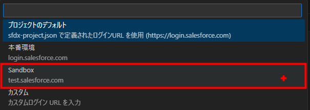

<!-- omit in toc -->
# Salesforce環境構築手順

- [1. 概要](#1-概要)
  - [1.1. 手順書作成時の端末情報](#11-手順書作成時の端末情報)
  - [1.2. 本テーマのゴール](#12-本テーマのゴール)
  - [1.3. 参考サイト](#13-参考サイト)
- [2. VSCode](#2-vscode)
  - [2.1. ダウンロード](#21-ダウンロード)
  - [2.2. 日本語化](#22-日本語化)
- [3. Salesforce CLI](#3-salesforce-cli)
  - [3.1. おまけ解説](#31-おまけ解説)
  - [3.2. ダウンロードページの「Download for Windows x64」をクリック](#32-ダウンロードページのdownload-for-windows-x64をクリック)
  - [3.3. ダウンロードしたファイルをインストール](#33-ダウンロードしたファイルをインストール)
  - [3.4. ダウンロード確認](#34-ダウンロード確認)
  - [3.5. コマンドプロンプトを起動](#35-コマンドプロンプトを起動)
  - [3.6. ツールのバージョンを確認する【必須】](#36-ツールのバージョンを確認する必須)
- [4. Salesforce Extension for VSCode](#4-salesforce-extension-for-vscode)
  - [4.1. VSCodeの左サイドバーから拡張機能を選択](#41-vscodeの左サイドバーから拡張機能を選択)
  - [4.2. 「Salesforce Extension Pack(Expanded)」をインストール](#42-salesforce-extension-packexpandedをインストール)
  - [4.3. VSCodeを再起動](#43-vscodeを再起動)
- [5. JDK11](#5-jdk11)
  - [5.1. JDKをダウンロード](#51-jdkをダウンロード)
  - [5.2. ダウンロードしたインストーラーを実行（デフォルト設定のまま）](#52-ダウンロードしたインストーラーを実行デフォルト設定のまま)
  - [5.3. salesforcedx-vscode-apex.java.homeにパスを設定](#53-salesforcedx-vscode-apexjavahomeにパスを設定)
- [6. ローカルにSalesforceのプロジェクトを作成](#6-ローカルにsalesforceのプロジェクトを作成)
- [7. Salesforceの組織へ接続](#7-salesforceの組織へ接続)
- [8. ソースをSalesforce組織から取得](#8-ソースをsalesforce組織から取得)
- [9. Node.jsをインストールし%プロジェクト指定パッケージをインストール](#9-nodejsをインストールしプロジェクト指定パッケージをインストール)
<!--------------------------------------------------------------------------------------->
## 1. 概要
### 1.1. 手順書作成時の端末情報
|対象|内容|
|:--|:---|
|端末|Windows 11、64tbit端末|
|利用Salesforce環境| TSSの組織に作成したSandbox|
|Sandbox名|ApexTest|
|Sandbox組織ID|00DIo000000LH08|

### 1.2. 本テーマのゴール
- VSCodeをインストール
- Salesforce CLIをインストール
- VSCodeに拡張機能をインストール
- VSCode上からSalesforceのサンドボックスにアクセスする
⇒Apexの実装やテスト等は別テーマにて

### 1.3. 参考サイト
[Trailhead:開発の準備を整える](https://trailhead.salesforce.com/ja/content/learn/projects/get-started-with-salesforce-development/get-ready-to-develop?trail_id=force_com_dev_beginner)
⇒素直に実施しても、エラーが発生したり躓くようなので本手順で詳細化

<!--------------------------------------------------------------------------------------->
## 2. VSCode
### 2.1. ダウンロード
[VSCodeの公式サイト](https://code.visualstudio.com/)
VSCodeのインストール方法は検索すればいくらでも出てくるので詳細は割愛
Windows版をダウンロードして、EXEファイルをクリックしてデフォルト選肢のままインストール

### 2.2. 日本語化

|メニュー　→　View　→　Command Palette　→　Configure Display Language　→　日本語　→　再起動|
|:--|
||
||
||

<!--------------------------------------------------------------------------------------->
## 3. Salesforce CLI
### 3.1. おまけ解説
***■CLIとは***
CLIとはCommand Line Interface：コマンドラインインターフェースの略称
コマンドプロンプトとかターミナル等からコマンド形式で色々実行できるもの
新人研修で触れたJavaのSpringにもSpring CLIというものがある＝CLIはSalesforceに限った概念ではないです

***■Salesforce CLIを導入する理由***
Salesforce CLIは、コマンド等でSalesforceの色々な事が実行できるようにするためのツール
後述するVSCodeの拡張機能からプロジェクトを作成するときも、裏でSalesforce CLIのコマンドが実行されていたりするので
先にSalesforce CLIを導入しないと色々と便利な機能がそもそも動かない…といった状態になります。
[Salesforce CLI 設定ガイド](https://developer.salesforce.com/docs/atlas.ja-jp.sfdx_setup.meta/sfdx_setup/sfdx_setup_install_cli.htm)

### 3.2. ダウンロードページの「Download for Windows x64」をクリック
[Salesforce CLIのダウンロードページ](https://developer.salesforce.com/ja/tools/salesforcecli)

### 3.3. ダウンロードしたファイルをインストール
標準設定から特に変えずにインストールでOK

### 3.4. ダウンロード確認
***■注意点***
インストール時に環境変数のpath設定がされるはずなので
コマンド「sf」や「sfdc」コマンドが実行できるようになるはず…
ただpathが設定されず、後述のVSCodeの拡張ツールで不具合が発生したので
念のため以下の確認コマンドを実施してください。

### 3.5. コマンドプロンプトを起動
「Ctrl + r」→ ファイル名を指定して実行で「cmd」指定でも起動可

### 3.6. ツールのバージョンを確認する【必須】
CDコマンドで、「ツールをダウンロードしたパス/bin」に移動してSFコマンド実施

**コマンド例**
cd C:\Program Files\sf\bin
sf --version

このタイミングで環境変数のpathが設定されていない場合、設定してくれている模様
※VSCodeを開いてる場合は念のためVSCodeを再起動してください。

<!--------------------------------------------------------------------------------------->
## 4. Salesforce Extension for VSCode
### 4.1. VSCodeの左サイドバーから拡張機能を選択

### 4.2. 「Salesforce Extension Pack(Expanded)」をインストール
メモ：（Expanded）とついている方が拡張機能が多く含まれるらしい

### 4.3. VSCodeを再起動
メモ：再起動しなくても使えるけど、後述のコマンド検索時に日本語訳が出てこないかも…

<!--------------------------------------------------------------------------------------->
## 5. JDK11
***JDK11の導入が必要な理由***
Salesforce Extension Packの一部機能を動かすためJDK11(Javaの開発キット)の導入が必要

ツールの説明だとJDK8 or 11の導入が必要とされているがJDK8だと警告が出るので11導入
※JDK8でも警告が出るだけで問題ないらしいが見栄えが悪いので…

### 5.1. JDKをダウンロード

[JDK11リンク](https://www.azul.com/downloads/?package=jdk#download-openjdk)

Oracle版はダウンロードに会員登録が必要で面倒なので

今回はOpenJDKのAzule版を活用（JDKであれば別でも問題ないはず）

Java 11が出てくるまで、ページを下にスクロールする

### 5.2. ダウンロードしたインストーラーを実行（デフォルト設定のまま）

### 5.3. salesforcedx-vscode-apex.java.homeにパスを設定

左下の歯車マーク→設定 or ファイル→ユーザ設定→設定

ダウンロード先を変えていなければ「C:\Program Files\Zulu\zulu-11」を指定で良いはず

<!--------------------------------------------------------------------------------------->
## 6. ローカルにSalesforceのプロジェクトを作成
|6.1. コマンドパレットを開き(Ctrl+Shift+p)、SFDXと検索し「Create Project with ..」を選択|
|:--|
||

|6.2. テンプレートを選択（とりあえず標準を選択）|
|:--|
||

|6.3. 適当なプロジェクト名を入力してEnter|
|:--|
||

|6.4. 作成するフォルダに移動して「プロジェクトを作成」ボタンを押下|
|:--|
||
|注意点：フォルダパスに日本語名が入っていない方が無難|

|6.5. 以下の感じでフォルダが作成されればOK|
|:--|
||
||

<!--------------------------------------------------------------------------------------->
## 7. Salesforceの組織へ接続
|7.1. コマンドパレットを開き、SFDX:Authと検索し「Authorize an Org」を選択する|
|:--|
||

|7.2. 接続する組織の種別を選択（今回はSandbox）|
|:--|
||

|7.3. 組織のエイリアスを指定（TSSの場合、以下の「tohosystem」部分）|
|:--|
|https://**tohosystem**.lightning.force.com/|
||

|7.4. Webブラウザでログイン画面が立ち上がる→ログイン|
|:--|
|本番環境のユーザ名＋.sandbox名 maruyama.ryohei@tss.co.jp.**apextest*|
|※パスワードはサンドボックス作成時の、本番環境におけるパスワード|
||
||
||

|7.5. ログイン後、VSCodeの右下に認証が正常に実行された旨のメッセージが表示されていればOK|
|:--|
||

<!--------------------------------------------------------------------------------------->
## 8. ソースをSalesforce組織から取得
|8.1. manifestフォルダのpackage.xmlを右クリック→「～～ソースを組織から取得」|
|:--|
||

|8.2. 取得したファイルを確認|
|:--|
|成功すると正常実行された旨が表示される（コンソール上にも取得ファイルの一覧が表示）|
||
|プロジェクト作成時は空だったフォルダに、Salesforce組織から取得したファイルが追加される|
| ※キャプチャ通りのファイルが表示されていなくてもOK（ソースの増減とかあると思うので…）|

<!--------------------------------------------------------------------------------------->
## 9. Node.jsをインストールし%プロジェクト指定パッケージをインストール
|9.1. Node.jsの最新版（LTS）をダウンロードする|
|:--|
|[Node.jsのダウンロードページ](https://nodejs.org/en/download/prebuilt-installer)|
| ***LTSの最新バージョンをダウンロード***|

|9.2. Node.jsのインストール|
|:--|
|ダウンロードしたインストーラーを、デフォルト設定のままインストール|
||
||

|9.3. ターミナルを開く|
|:--|
| ※ターミナルの開き方は色々…。標準のpowershellでもbashでも問わず実施できるはず|

**注意：以降の手順は実施不要**

|9.4. npm installを実行|
|:--|
|***実施したいこと***|
|・拡張ツールで作成したプロジェクトにpackage.jsonというファイルが自動生成されている ・package.jsonにはプロジェクトに必要なパッケージが色々記載されている ・npm installを実行すると、コマンド実行時のフォルダ直下にある ・package.jsonに記載されたパッケージをWebからインストールしてくる|
|***注意点***|
|package.jsonの内容がイマイチ？ パッケージ間のバージョンに不整合が発生あるようでエラーが発生してしまう…。|
||

2024/10時点だとエラーになる…

***エラーログのメモ***
- eslintはpacage.configだと9.91が指定されている
- 別パッケージの「lwc/eslint-plugin-lwc」は「eslintのバージョンが7.00～8.00」を前提としている
- 9.91 ⇔ 7.00～8.00という依存関係の不整合が解決できない
- 解決策としては不整合を解決するようpacage.configの設定を変更するか
- npm installのコマンドに「--force」か「--legacy-peer-deps」つけて押し通す
⇒後述手順を進めても、Salesforce組織にNode.js関係をデプロイしないっぽいのでいったんスルーして進める

|9.5. npmインストール再実施（--legacy-peer-depsをオプション）|
|:--|
||
|ワーニングは出てしまう…がまぁいいか|
||

***ワーニングのメモ***
- npm warn deprecated 理由＝制作者によって非推奨化されている＝パッケージ構成的に古いよ（Javaでも変数やメソッドに@deprecatedつけて非推奨を知らせるやつ）
- install command is DEPRECATED＝パッケージが非推奨
- found 0 vulnerabilities＝脆弱性は0だよ

***■暫定の認識***
- 拡張ツールが作成する標準プロジェクトで使ってるパッケージ構成は古めなのでイマイチ？
- 動かないわけじゃな無さそう＆学習という面なら問題なさそうな気がするので、いったん無視して進める

***■本開発用の備忘録***
- 標準プロジェクトのpacage.configを参考に、プロジェクト用の最新構成を整える必要があるはず
- もしくは空のプロジェクトを作成して、一から検討とか
- この辺りはVisualforce（Javaでいうjsp）やJavaScriptをどれぐらい活用するか
- TypeScriptを使うなら設定ファイルは結構変わる気がする
- 何ならVSCodeの拡張機能の一覧とかも整備しておいた方が良いよなぁ…
- 学習の最後あたりに理解が深まっていれば、もう少しまともな環境構成が検討出来たらよいな…

