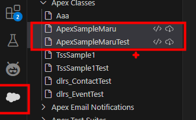
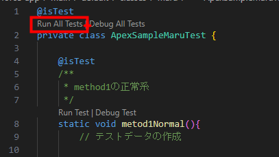
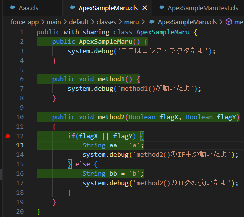

<!-- omit in toc -->
# ApexのPG/PT

- [1. 概要](#1-概要)
- [2. Apexクラスを作成しよう](#2-apexクラスを作成しよう)
  - [2.1. classes直下にフォルダを作成](#21-classes直下にフォルダを作成)
  - [2.2. Apexクラスを作成](#22-apexクラスを作成)
  - [テスト用に簡単なロジックを追加しましょう](#テスト用に簡単なロジックを追加しましょう)
- [3. テストクラスを作成しよう](#3-テストクラスを作成しよう)
  - [3.1. クラス作成時と同手順で、〇〇Testというクラスを作成する](#31-クラス作成時と同手順で〇〇testというクラスを作成する)
  - [3.2. 以下を参考にテストソースを作成する](#32-以下を参考にテストソースを作成する)
- [4. 作成したクラス、テストクラスをSalesforce組織にデプロイ](#4-作成したクラステストクラスをsalesforce組織にデプロイ)
- [5. カバレッジ取得のための設定を行う（初回のみ）](#5-カバレッジ取得のための設定を行う初回のみ)
- [6. テストを実行①](#6-テストを実行)
- [7. カバレッジを可視化する](#7-カバレッジを可視化する)
- [8. テストを実行②](#8-テストを実行)
- [9. デバッグしてみよう](#9-デバッグしてみよう)

## 1. 概要
本資料ではApexで単純なロジックを作成→テストクラス作成→カバレッジ取得までを解説する
※DB操作とか、テストクラスのベストプラクティス化とかまで一気に説明できそうなら説明しちゃう

## 2. Apexクラスを作成しよう
### 2.1. classes直下にフォルダを作成
|フォルダ直下→右クリック→新しいフォルダ|
|--|
||

※ここで作成したフォルダ名はSalesforce組織に登録されないので適当でOK
他の人と被ると微妙かもしれないので（TESTとかSAMPLE）とか、被ら無さそうな名前が良いかも

||
|:--|
|※最終的にソースをSalesforce組織にデプロイするが、その際にフォルダ構成は反映されない。<br>→自由につけて問題ないけど、一応は他の人と被らない方が良いかも


**補足**
Readmeにも書いたけれどApexは名前空間が存在しないので
本当にApexの初歩だけ触れると、フォルダ分けでき無さそうに見えてしまう
↓
ローカル上ではフォルダ分けできるけど、Salesforce組織では平で管理されるだけなので
Javaと同様、分かりやすいフォルダ分けをしながら作成する方が良さそう
（良くあるControllerとかBusinessとか？）

### 2.2. Apexクラスを作成
|1. [Ctrl+Shift+p]→[SFDX] or フォルダを右クリック→Apexクラスを作成|
|:--|


|2.クラス名を入力。ほかの人と被ら無さそうな名前が良いです|
|:--|
||

|3.フォルダ指定 ※フォルダ→右クリックの人は出ないはず|
|:--|
||
||

|4. 〇〇clsと〇〇cls-meta.xmlが作成されればＯＫ|
|:--|
||


**■ApexSampleMaru.cls**
``` Java:ApexSampleMaru.cls
public with sharing class ApexSampleMaru {
    public ApexSampleMaru() {

    }
}
```

**空クラスのJavaとの違い＝with sharing**
[ヘルプ](https://developer.salesforce.com/docs/atlas.ja-jp.apexcode.meta/apexcode/apex_classes_keywords_sharing.htm)
Salesforceではデータアクセス機能といって、ユーザ権限によってアクセス範囲が異なる特徴がある
with sharingをつけるとApexコードを実行したユーザ権限の範囲で処理が行われ
without sharingだとユーザ権限関係なく動いたりする
⇒Javaのように何もつけずにpublic class...と記載する事もできるが
　非推奨とされている（裏ではwith sharing扱い）

**■ApexSampleMaru.cls-meta.xml**
``` XML:ApexSampleMaru.cls-meta.xml
<?xml version="1.0" encoding="UTF-8"?>
<ApexClass xmlns="http://soap.sforce.com/2006/04/metadata">
    <apiVersion>62.0</apiVersion>
    <status>Active</status>
</ApexClass>
```

**APIバージョン**
Salesforceは頻繁にアップデートされるので
自分が実装したApexコードを、どのAPIバージョンで動くかを指定可能

### テスト用に簡単なロジックを追加しましょう
~~~ Java:Java:ApexSampleMaru.cls
public with sharing class ApexSampleMaru {
    public ApexSampleMaru() {
        system.debug('ここはコンストラクタだよ');
    }

    public void method1() {
        system.debug('method1()が動いたよ');
    }

    public void method2(Boolean flagX, Boolean flagY)
    {
        if(flagX || flagY) {
            String aa = 'a';
            system.debug('method2()のIF中が動いたよ');
        } else {
            String bb = 'b';
            system.debug('method2()のIF外が動いたよ');
        }
    }
}
~~~

※ロジックコピーせず、自由にコーディングしてもＯＫ（むしろ推奨）
|ソース内容|補足|
|:--|:--|
|system.debug|JavaでいうSystem.out.println("aaa");に近いもの<br>カバレッジとしては計測対象外<br>デバッグ実行時にデバッグコンソールに値が出力される|
|コンストラクタ|Javaと同じ。ロジックは書いても書かなくてもOK|
|method1|呼び出せばカバレッジ100%となる単純ロジック|
|method2|分岐があるパターン。引数を2つ設定したのはカバレッジを100%にするために<br>[true:true] [true:false] [false:true][false:false]の4ケース必要か確認した時の名残<br>結果的にはif文全体でtrue/falseが満たせれば100%になった=2ケースでOK|


## 3. テストクラスを作成しよう
### 3.1. クラス作成時と同手順で、〇〇Testというクラスを作成する

### 3.2. 以下を参考にテストソースを作成する

~~~Java
@isTest
private class ApexSampleMaruTest {

    @isTest
    /**
     * method1の正常系
     */
    static void metod1Normal(){
        // テストデータの作成
        
        // 期待値の作成
        String expected = 'XXX';
        String actual = 'XXX'; // 結果を捏造…

        // テスト対象のインスタンス化
        ApexSampleMaru target = new ApexSampleMaru();

        // テスト対象メソッドの呼び出し
        target.method1();

        // 結果の検証
        System.assertEquals(expected, actual, '〇〇検証でNG発生');
    }

    @isTest
    /**
     *  method2の正常系：IF文がFalseのケース
     */
    static void metod2NormalIF1False(){
        // テストデータの作成
        Boolean flagX = false;
        Boolean flagY = false;   
        // 期待値の作成
        String expected = 'XXX';
        String actual = 'XXX'; // 結果を捏造…

        // テスト対象のインスタンス化
        ApexSampleMaru target = new ApexSampleMaru();

        // テスト対象メソッドの呼び出し
        target.method2(flagX, flagY);

        // 結果の検証
        System.assertEquals(expected, actual, '〇〇検証でNG発生');
    }

    @isTest
    /**
     *  method2の正常系：IF文がTrueのケース
     */
    static void metod2NormalIF1True(){
        // テストデータの作成
        Boolean flagX = false;
        Boolean flagY = false;   
        // 期待値の作成
        String expected = 'XXX';
        String actual = 'XXX'; // 結果を捏造…

        // テスト対象のインスタンス化
        ApexSampleMaru target = new ApexSampleMaru();

        // テスト対象メソッドの呼び出し
        target.method2(flagX, flagY);

        // 結果の検証
        System.assertEquals(expected, actual, '〇〇検証でNG発生');
    }
}
~~~
**テストコードの編集ポイント**
完全にコピペして実行すると、ApexSampleMaruというクラスのテストになってしまうため修正が必要。
①public with sharing class...→private class...
②各テストメソッド内のテスト対象のインスタンス化部分を、自分が作成したクラスに変更


**テストコード解説**
|内容|補足|
|:--|:--|
|@isTest|テストクラスとメソッドにはアノテーションをつける<br>メソッドにはstatic testMethod 〇〇~と書く方法もあるけど古いし非推奨|
|ベストプラクティス|本当は〇〇でデータ作成、実施前処理、実施後処理みたいなベストプラクティスが存在する。今はそれっぽく見えるで適当に書いてます|
|System.assertEquals|常にテスト成功となる意味ないコードになってる。書かないと警告でるので暫定対応|

## 4. 作成したクラス、テストクラスをSalesforce組織にデプロイ
|4.1. 作成クラスを右クリック→「このソースを組織へデプロイ|
|:--|
||

|デプロイ成功すると右下に正常の旨が表示され、コンソールにデプロイ対象ソースが表示される|
|:--|
||

|失敗する場合、コンソール欄の問題タブにエラー内容が表示される|
|:--|
|コンパイルエラー系とかで良く起きる。Todo:画像が取得出来たら張り替え|

|4.2. テストクラスも同手順でデプロイ|
|:--|
|成功するとSalesforce組織の「Apex Classes」フォルダに配置される|
||

## 5. カバレッジ取得のための設定を行う（初回のみ）
|5.1. VSCodeの設定画面を開く「Ctrl + ,」 or 左下の歯車から設定選択|
|:--|
||

|5.2. 「Salesforce cover」等を検索して、カバレッジ設定にチェックをつける|
|:--|
|salesforcedx-vscode-core.retrieve-test-code-coverage|
||

## 6. テストを実行①
|6.1. テストクラスに移動し、メソッド上の「Run Test」をクリック|
|:--|
||

|6.2. テスト結果をコンソールで確認する|
|:--|
||
|1つめの33%：テストメソッド「metod1Normal」を実行した際のカバレッジ網羅率|
|2つめの33%：テスト対象「クラス」の「累計」カバレッジ網羅率|

|6.3. 2つめのテストメソッド上の「Run Test」をクリックする（metod2NormalIF1False）|
|:--|
||

|6.4 テスト結果をコンソールで確認する|
|:--|
||
|67%：テストメソッド「metod2NormalIF1False」を実行した際の～～|
|83%：6.1の「metod1Normal」と合わせてクラス累計のカバレッジ網羅率|


## 7. カバレッジを可視化する
|7.1. VSCode左下の「三」をクリックする（Apexコードカバレッジを強調表示）|
|:--|
||

|7.2. テスト対象クラスに移動する|
|:--|
||
|ソースコードの大半がデバッグログ用で分かりずらいけれど、緑がテスト済、赤がテスト未実施という表示となる|

## 8. テストを実行②
察しが良い人はもう実施しているかもしれませんが
今まではテストメソッド毎の「Run test」をクリックしていたので
今度はテストクラス自体の「Run All Tests」をクリックして、全テストを実行しましょう


|テスト結果を確認する|
|:--|
||
|各テストメソッドがカバレッジを網羅し、最終的に100％となったという見方になる|


**テスト対象クラスを参照しても、赤表示が消えている**


## 9. デバッグしてみよう
**ケース設定**
テスト対象クラスの「method2」内のIF文で、true or falseのどちらかが動いてるか確認したい

|9.1. ブレークポイントを設定|
|:--|
||
|ソースの欄外をクリックしてブレークポイントを設定する|
|IF文のどちらかで止まればよいので、IF文内を両方設定しておく|

|9.2. テストメソッドの「Debug Test」をクリックする|
|:--|
||
|今回はFALSE系の「metod2NormalIF1False」をデバッグ実行する|

|9.3. デバッグ画面を確認する||
|:--|:--|
|画面左上|ブレークポイントに到達した時点の変数情報が表示される|
|画面右上|良くあるデバッグを進めるためのコマンド？をGUI実行できる<br>F5：続行＝次のブレークポイントを無視してテスト続行<br>F10：ステップオーバー＝次の行に移動<br>F11：ステップイン＝呼び出している関数/メソッドの中に移動<br>Shift＋F11：ステップアウト＝ステップインした後、呼び出し元に戻るとこまで移動<br>**ステップインを意識的に使えるかがファーストステップ？**
|画面真ん中|一時停止している状態が表示される|
|画面下のデバッグコンソールタブ|<br>テスト対象クラスに記載されていた「system.debug(~~~);」の内容が表示される<br>通常実行時には出力されないので注意|

**補足**
- デバッグ方法はプログラミング言語問わず大体は同じ
- 開発環境によってショートカットが違うぐらい？
- 他にもウォッチ式とかコールスタックとか解析要素あり(Apexだと機能しない要素もありそうだけど)

**④画面下のデバッグコンソール**
ます
通常の実行時は「出力」タブ側には出力されないので注意

