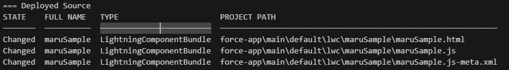
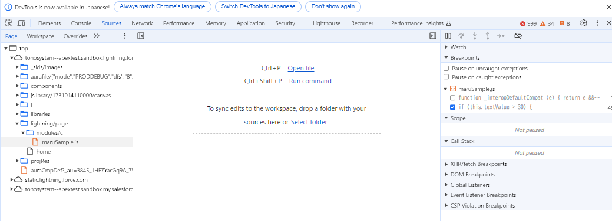

<!-- omit in toc -->
# LWCのPG/PT
- [1. 概要](#1-概要)
- [2. LWCを作成しよう](#2-lwcを作成しよう)
- [3. LWCを実装してデプロイしてみよう](#3-lwcを実装してデプロイしてみよう)
  - [3.1. 今回実装するコンポーネントイメージ](#31-今回実装するコンポーネントイメージ)
  - [3.2. HTMLを修正](#32-htmlを修正)
  - [3.3. JavaScriptを修正](#33-javascriptを修正)
  - [3.4. meta.xmlを修正](#34-metaxmlを修正)
  - [3.5. ソースを組織にデプロイする](#35-ソースを組織にデプロイする)
  - [3.6. 作成したコンポーネントをSalesforceに埋め込んでみる](#36-作成したコンポーネントをsalesforceに埋め込んでみる)
  - [3.7. おまけ①：コンポーネントに関するプチ解説](#37-おまけコンポーネントに関するプチ解説)
  - [3.8. おまけ②：ブラウザの開発者ツール上でdebugしてみる](#38-おまけブラウザの開発者ツール上でdebugしてみる)
    - [3.8.5. デバッグしたいソースが動くよう画面を操作する](#385-デバッグしたいソースが動くよう画面を操作する)
- [4. LWCをテストしてみよう](#4-lwcをテストしてみよう)
  - [4.1. Salesforce CLIを最新化](#41-salesforce-cliを最新化)
  - [4.2. lwcのテスト環境をセットアップ](#42-lwcのテスト環境をセットアップ)
  - [4.3. テストコードを実装](#43-テストコードを実装)
  - [4.4. テストを実施してみよう](#44-テストを実施してみよう)
  - [4.5. まとめてテストを実施する場合](#45-まとめてテストを実施する場合)
  - [4.6. カバレッジを取得してみよう](#46-カバレッジを取得してみよう)
  - [4.7. デバッグを実施してみよう](#47-デバッグを実施してみよう)
- [5. ローカル側でLWCを動作確認してみよう](#5-ローカル側でlwcを動作確認してみよう)
  - [5.1. LWC用のローカルサーバをインストール](#51-lwc用のローカルサーバをインストール)
## 1. 概要
本パートは
・LWCで単純なページ作成→Salesforce組織に反映
・ブラウザ上でテストしたり、JavaScriptのテストコード書いてみたり

## 2. LWCを作成しよう
|2.1. lwcフォルダを右クリック→Lightning Webコンポーネントを作成| 
|:--|
||

|2.2. ファイル名を設定する|
|:--|
||
|**注意**：小文字始まりというネーミングルールがあったはず 実際にデプロイして動作確認するので、他の人と被らなそうな名前で…|
||
||

|2.3. 作成された内容確認|
|:--|
||
|__tests__フォルダ：テストコードを格納する場所|
|XX.html：デザインを書く場所|
|XX.js：コンポーネントのロジックを書く場所|
|XX.xml：コンポーネントのメタ情報を書く場所|

## 3. LWCを実装してデプロイしてみよう
### 3.1. 今回実装するコンポーネントイメージ

|仕様イメージ|
|:--|
|・年齢を入力するテキストが一つ ・テキストに応じて変わるラベル？が一つ ・～30歳で若手判定、31～はベテラン判定|
||
||

### 3.2. HTMLを修正
~~~ HTML
<template>
    <lightning-card title="ここはlightning-cardだよ">
        <lightning-input label="年齢を入力してね：ここはlightning-inputだよ" value={textValue} onchange={testTextChangeHandler}></lightning-input>
        
あなたは{editValue}

    </lightning-card>
</template>
~~~

**LWCのHTML補足**
**①必ず\<tamplate>タグで囲む必要あり**
普通にWebページを一から作成しようとすると\<!DOCTYPE html>とか\<html>で始まるけれど
LWCはコンポーネントなので、部品部品を作っているイメージ

**②\<lightning-card>、\<lightning-input>タグは現時点では気にしなくてOK**
絶対に使わなければダメという物ではなくて、普通？のタグでも実装可能
ただ、利用すればSalesforceに馴染んだ感じになるものなので
プロジェクトで〇〇ライブラリを利用する方針…とかが無ければ使った方が良いかも？

③{}で囲った部分（value={textValue}、あなたは{editValue}）
いったんは{}内の変数が、JavaScript側の変数とリンクしている理解でOK

### 3.3. JavaScriptを修正
~~~ JavaScript
import { LightningElement } from 'lwc';

export default class MaruSample extends LightningElement {
    textValue = '30';
    editValue = 'わかて';

    testTextChangeHandler(event) {
        this.textValue = event.target.value;
        if(this.textValue > 30) {
            this.editValue = 'ベテラン';
        } else {
            this.editValue = '若手'; // テスト用に初期値のひらがなとは別で漢字にしてみる
        }
    }
}
~~~

**JavaScriptの補足**
①extendsしているクラス以外はふつうのJavaScriptと変わらない

②JavaScript側で変数が変わったら画面を再描画＆プレースフォルダの値も変更させるために
以前は変数に@tracをつける必要があった。
どこかのバージョンアップで使い分けがキツかったのか？デフォルトで@trac扱いになったらしい。
今回の例でいうと@trac editValueとか記載しないとダメらしい。
Udemyとか個人ブログのソースだと@tracをついている事があるので、今は省略しても大丈夫と理解しておけばOK

### 3.4. meta.xmlを修正
[公式のXMLヘルプ](https://developer.salesforce.com/docs/platform/ja-jp/lwc/guide/reference-configuration-tags.html)
~~~ xml
<?xml version="1.0" encoding="UTF-8"?>
<LightningComponentBundle xmlns="http://soap.sforce.com/2006/04/metadata">
    <apiVersion>62.0</apiVersion>
    <isExposed>true</isExposed>
    <targets>
        <target>lightning__RecordPage</target>
        <target>lightning__HomePage</target>
        <target>lightning__AppPage</target>
    </targets>
</LightningComponentBundle>
~~~

**xmlの補足**
詳細は公式ヘルプ見れば書いてあるので、代表的なのだけ…

\<isExposed>
デフォルトだとfalse
trueに変更すると、Salesforceのアプリビルダーみたいな画面で選択できるようになる
画面に埋め込みたいコンポーネントはtrue
間接的にしか利用されないコンポーネントはfalse
(〇〇検索機能みたいな物はtrue、検索画面の一要素の□□テキスト部品みたいなのはfalse)

\<targets>\<target>
どこでLWCを利用可能とするか指定できる
ホーム画面だけで使うのであれば「lightning__HomePage」だけ
〇〇オブジェクトのレコードページだけで使うのであれば「lightning__RecordPage」だけ

### 3.5. ソースを組織にデプロイする
|・関連するファイルを右クリック→組織へデプロイ ・関連するファイルのソース上で右クリック→組織へデプロイ|
|:--|
||
| html上でデプロイしても、js,xmlといった関連ファイルも合わせてデプロイされる|

### 3.6. 作成したコンポーネントをSalesforceに埋め込んでみる
|例：ログインした後のホームに追加してみる|
|:--|
||
|xmlファイルでisExposed=trueにしたLWCが選択できるようになっているはず。 xmlのタグを追加すればファイル名じゃなくて任意の名前を表示することもできるはず |
||
||
||
||

### 3.7. おまけ①：コンポーネントに関するプチ解説
**作成したLWCがどういうソースになっているか覗いてみる**

|3.7.1. F12キーを押下して開発者ツールを表示|
|:--|
||

|3.7.2 左上の矢印マークをクリック→自分が作成したLWC付近を選択|
|:--|
||
||

|3.7.3 真ん中にソースが表示されるので、自分が作成したファイル名に近いものを探す|
|:--|
||
|・\<lightning-card>、\<lightning-input>、\
ぐらいしか書いてないのに 　実際は色々タグ保管されている|
|c_〇〇という形でコンポーネント化されて利用されている →c_というのがデフォルトの名前空間らしい。c_〇〇で指定するものと覚えておけばOK|

### 3.8. おまけ②：ブラウザの開発者ツール上でdebugしてみる
|3.8.1. Salesforceから設定→デバッグモード→対象ユーザを選択して有効化|
|:--|
||

**3.8.2 F12とかで開発者ツールを開く**

|3.8.3. [Ctrl+p]→自分が作成したファイル名で検索|
|:--|
||

|3.8.4. Classっぽい部分を探す→行数左をクリックしてブレークポイントを設定|
|:--|
||

#### 3.8.5. デバッグしたいソースが動くよう画面を操作する
例：年齢を30→31に変更

- 参照したい変数にカーソルあてて表示されるのを待つ
- 右側のScopeから、参照したいソースを辿って(....)をクリックして中身を見る
- ソースにconsole.log～みたいなログ出力用のコードを埋め込む
  
遊び心を持たせてthis.textValueを参照ではなく、event.target側を見てみるとかね
↓な感じでtargetの中にはvlue以外にも色々入ってるのかーとか見ることが出来る

**補足**
Q：なぜデバッグモードを有効化するのか？
A：「ブラウザでデバッグする時」にソースがデバッグしやすい形で見れるから

■デバッグモードOFF時のソース→処理しやすいよう丸め？られてる
この状態でも良ければ実はデバッグ可能
ブラウザからではなくVSCodeからデバッグする場合はデバッグモードのON/OFFは関係しない
~~~ JavaScript
        class g extends t.LightningElement {
            constructor(...e) {
                super(...e),
                this.textValue = "30",
                this.editValue = "わかて"
            }
            testTextChangeHandler(e) {
                this.textValue = e.target.value,
                this.textValue > 30 ? this.editValue = "ベテラン" : this.editValue = "若手"
            }
        }
~~~

■デバッグモードON時のソース→よりコーディング時のソースに近づく
~~~ JavaScript
    class MaruSample extends lwc.LightningElement {
      constructor(...args) {
        super(...args);
        this.textValue = '30';
        this.editValue = 'わかて';
      }
      testTextChangeHandler(event) {
        this.textValue = event.target.value;
        if (this.textValue > 30) {
          this.editValue = 'ベテラン';
        } else {
          this.editValue = '若手'; // テスト用に初期値のひらがなとは別で漢字にしてみる
        }
      }
~~~

## 4. LWCをテストしてみよう

[Jestの設定-Trailhead](https://trailhead.salesforce.com/ja/content/learn/modules/test-lightning-web-components/set-up-jest-testing-framework)

### 4.1. Salesforce CLIを最新化

|ターミナル→sf update|
|:--|
| 更新されてそうならOK|

### 4.2. lwcのテスト環境をセットアップ

**注意**
公式のページ通りに進めてもエラーになるので、最終的には以下の③だけ実施すればOK

|①公式ページ手順：sf force lightning lwc test setup|
|:--|
|→Node.jsパッケージ間の依存関係が解消できなくてエラー|

|②公式ページ手順：npm install、npm install @salesforce/sfdx-lwc-jest --save-devでも実施可能|
|:--|
|→これもNode.jsパッケージ間の依存関係が解消できなくてエラー|

|③npm install時に--forceオプションをつけて、無理やりインストールする|
|:--|
|コマンド①：npm --force install|
||
|コマンド②：npm --force install @salesforce/sfdx-lwc-jest --save-dev|
||

色々とエラーが発生して、ググったりするとパッケージが古いとか脆弱性が…とか出てくる。
ただ公式サイトに「一定の脆弱性が検出される可能性がありますが、ここでは関係ない」と言ってるのでスルーしちゃいましょう

### 4.3. テストコードを実装
LWCを作成した際に「__tests__フォルダ」＞「〇〇.test.js」という
テストコードが自動作成されていると思うので、中身を実装する

サンプルコード通りに実装していれば
MaruSample部分だけ読み替えれば大丈夫だと思います。

~~~ JavaScript
import { createElement } from 'lwc';
import MaruSample from 'c/maruSample';

describe('c-maru-sample', () => {
    afterEach(() => {
        // The jsdom instance is shared across test cases in a single file so reset the DOM
        while (document.body.firstChild) {
            document.body.removeChild(document.body.firstChild);
        }
    });

    it('サンプルテスト-年齢31歳以上　', () => {
        // Arrange
        const element = createElement('c-maru-sample', {
            is: MaruSample
        });

        // Act
        document.body.appendChild(element);
        
        // 入力テキストの部品を取得
        const lightningInput = element.shadowRoot.querySelector('lightning-input');
        
        // 年齢に31を入力した後、onchangeイベントを発生させる
        lightningInput.value = 31;
        lightningInput.dispatchEvent(new CustomEvent('change'));

        // 出力テキストの部品を取得
        const div = element.shadowRoot.querySelector('div');

        // Assert
        return Promise.resolve().then(()=>{
            expect(div.textContent).toBe('あなたはベテラン');
        });
    });

    it('サンプルテスト-年齢30歳以上　', () => {
        // Arrange
        const element = createElement('c-maru-sample', {
            is: MaruSample
        });

        // Act
        document.body.appendChild(element);
 
        // 入力テキストの部品を取得
        const lightningInput = element.shadowRoot.querySelector('lightning-input');
        
        // 年齢に30を入力した後、onchangeイベントを発生させる
        lightningInput.value = 30;
        lightningInput.dispatchEvent(new CustomEvent('change'));

        // 出力テキストの部品を取得
        const div = element.shadowRoot.querySelector('div');

        // Assert
        return Promise.resolve().then(()=>{
            expect(div.textContent).toBe('あなたは若手');
        });
    });
});
~~~

### 4.4. テストを実施してみよう

### 4.5. まとめてテストを実施する場合
テストコード側だと1ケースずつしか実施できないので

### 4.6. カバレッジを取得してみよう

|npm run test:unit:coverage|
|:--|
||
||
|単品でカバレッジ取得する方法もあると思うけど、いったんは全部分で…|

### 4.7. デバッグを実施してみよう
大まかな流れはApexと同じ。

|JavaScript側でブレークポイントを設定→テストソースからデバッグ実行|
|:--|
||
||

**小ネタ：変数の中身を確認（もっと色々出来るはず。ぐぐってみて）**
①参照したい箇所をソースコード上で選択
②左側の変数欄から参照したい変数を右クリック→ウォッチ式に追加

## 5. ローカル側でLWCを動作確認してみよう

### 5.1. LWC用のローカルサーバをインストール
ターミナルから以下コマンドを実行
sfdx plugins:install @salesforce/lwc-dev-server
→エラーが2,30分じゃ解消しなかった…
　海外勢も何種類かの理由でエラーになってそう。時間がもったいないので今回はスルー
